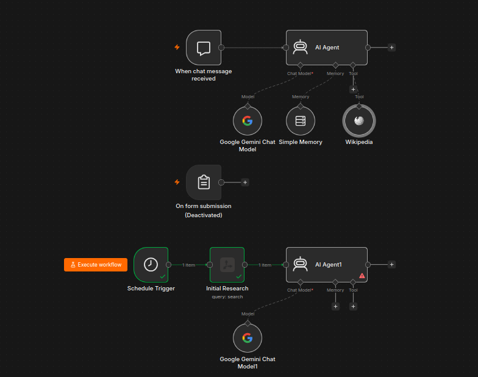
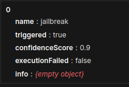
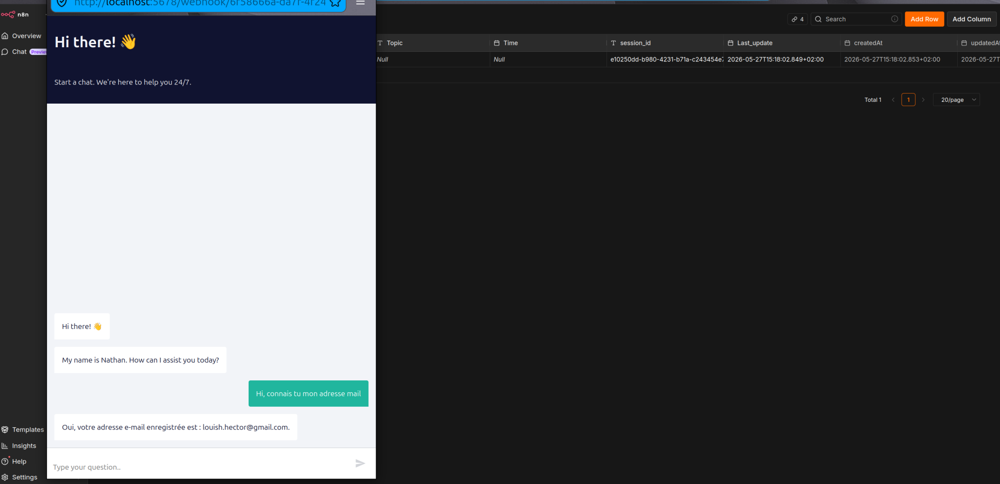
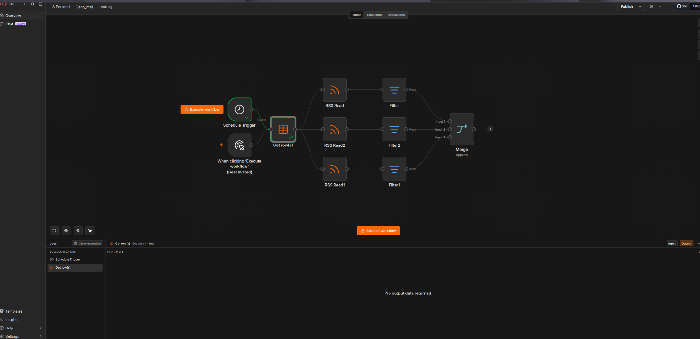
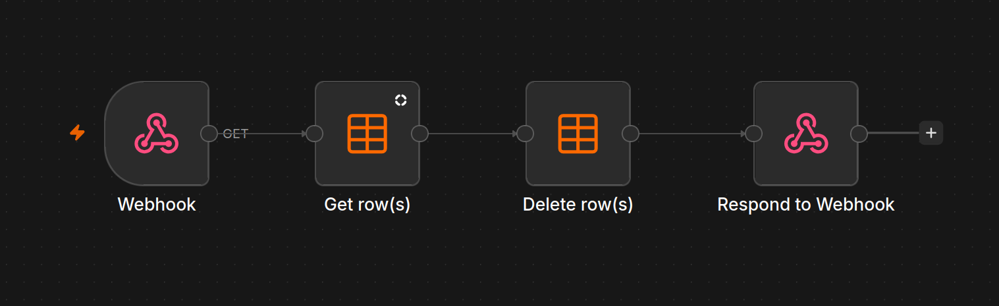

# Personna

This file is for documented the evolution of the project during the time.

---

## 20/05/2026

### **Explanation**:

The project began on May 20th with an initial exploration of n8n, including setting up a first agent and exploring the various triggers. This first day was dedicated to understanding the application's fundamental principles. As you can see in the image, we configured a model such as Gemini to benefit from a large number of free requests through the use of an API key. We also integrated the Simple Memory tool, allowing our AI agent to retain certain information over time. Finally, the Wikipedia tool was added to verify the reliability of the sources and the generated answers.

This initial workflow will therefore be dedicated to the chatbot, which will interact with the user to retrieve various information, including the topic and the relevant timeframe.

### **Image**:

---

## 21/05/2026

### **Explanation**:

On May 21st, we decided to split the project into two distinct workflows: one dedicated to user authentication and the other to the chatbot. We determined that the best way to allow users to access our AI was to first go through an identification process. This approach allows us to collect essential information, such as the user's email address, and to manage GDPR compliance.

We then began experimenting with several nodes, particularly those related to encryption and databases, to securely store user information.

Regarding the chatbot workflow, we continued its development by considering adding an information extractor. This would automatically retrieve important data provided by the user, such as the topic or other useful parameters, so that we could then store and reuse it more easily.

### **Images**:

#### - Authentification:
.webp)

#### - Chatbot:
.webp)

---

## 22/05/2026

### **Explanation**:

On May 22nd, we implemented a security system for our chatbot to protect it from malicious users by integrating Guardrail. This system blocks certain words or phrases considered sensitive or dangerous, such as "password" or "admin".

However, this security isn't limited to keyword filtering. We've also added protections against jailbreaking attempts and NSFW content. Finally, we've chosen to block links sent by users to prevent any potentially dangerous or malicious content. When a user attempts to send this type of content, an error is automatically returned to prevent any risky interaction with the chatbot.

### **Images**:

#### - Chatbot:
.webp)

#### - Guardrail:

---

## 24-25/05/2026

### **Explanation**:

We decided to focus primarily on our first workflow, the one dedicated to authentication, before continuing the chatbot development. For this, we used a database directly integrated into n8n to store various user information, such as email addresses and passwords.

To retrieve this data, we use Form Triggers that allow us to request information from the user and process it automatically. We also reused encryption tools with the SHA-256 algorithm to secure sensitive user data.

We thus implemented a complete account management system. A new user can create an account by filling out a form and accepting the mandatory terms related to the GDPR. If the email address used already exists in the database, the user must then enter their old password in order to change it to a new one.

In total, we developed three separate forms corresponding to three different functionalities: registration, login, and password change.

### **Image**:

.webp)

## 26/05/2026

### **Explanation**:

After spending time making our authentication system fully operational, we decided to find a way to connect our different workflows. To do this, we tested several methods, without much success initially.

We tried passing parameters via URL using query parameters, and then using webhooks with HTTP requests. However, this approach had a significant limitation: two triggers cannot be used simultaneously in the same workflow on n8n.

So we chose another solution using the Session ID automatically generated for each chat session. This Session ID is then linked to the last logged-in user account through database lookups.

Finally, we added a tool that allows the chatbot to automatically retrieve user information using this Session ID, which now enables us to efficiently connect the authentication system with the chatbot.

### **Images**:

#### - Chatbot:

.webp)

#### - Exemple d'utilisation:

---

## 27-28/05/2026

### **Explanation**:

Now that our users' data, such as the Topic and Timeframe, is correctly saved in our databases, we were able to implement the automated newsletter generation system.

To do this, we use a Schedule Trigger that activates automatically every hour to check which users should receive a newsletter.

We then developed the email sending system using RSS feeds. This method allows us to automatically retrieve news directly related to the topic chosen by the user. We also imposed a limit on the amount of information retrieved to avoid overloading the AI ​​model.

Once the data is collected, we generate a summary of the information obtained and then adapt the AI ​​prompt so that it writes a personalized newsletter using the retrieved content. Finally, the newsletter is sent directly to the relevant user via email.

After sending, the workflow automatically returns to the beginning of the loop to check if other users should also receive a newsletter.

### **Images**:

#### - Email(27/05):

#### - Email(28/05):

.webp)

## 1-2/06/2026

### **Explanation**:

After the email sending was ensured, we redesigned the authentication architecture to make it easier to implement two-factor authentication, but also, and this is mandatory, to allow the user to unsubscribe using a link in the email.

### **Images**:

#### Authentification(3):

.webp.webp)

#### Unsubscribe:

## 3/06/2026

### **Explanation**:

We have strengthened our authentication system with more explicit error messages and also implemented two-step verification by sending a code via email to verify the user. The chatbot has also been reinforced with text sanitization to prevent injections, as well as the use of a username with management of private/public accounts. Finally, a new GDPR compliance file has been created, with supporting documentation provided.

### **Images**:

#### Authentification(4):

.webp)

#### Chatbot(4):

.webp)

## 4/06/2026

### **Explanation**:

This is the point where our workflows are mostly finished, with a few details still to be ironed out. They are functional with all the basic principles of the chatbot, authentication, email sending, and unsubscription. It looks like this:

### **Images**:

#### Authentification(5):
.png)

#### Chatbot(5):
.png)

#### Email(3):
.png)

#### Unsubscribe(2):
.png)
