# Installation Guide: Docker & n8n with CSV Database

This guide explains how to install Docker and run n8n persistently, integrating the `USER.csv` data file.

---

## 1. Installing Docker (Ubuntu)

**If you already have Docker installed on your machine, you can skip directly to section 2.**

### Step 1.1 : Configuration

Everything that follows can perhaps be copied and pasted into a terminal.
https://doc.ubuntu-fr.org/docker

#### (Update the system)
```bash 
sudo apt update
sudo apt install ca-certificates curl
```

#### (Add the official Docker GPG key)
```bash 
sudo install -m 0755 -d /etc/apt/keyrings
sudo curl -fsSL https://download.docker.com/linux/ubuntu/gpg -o /etc/apt/keyrings/docker.asc
sudo chmod a+r /etc/apt/keyrings/docker.asc
```

#### (Add the repository to the APT sources)
```bash
echo \
  "deb [arch=$(dpkg --print-architecture) signed-by=/etc/apt/keyrings/docker.asc] https://download.docker.com/linux/ubuntu \
  $(. /etc/os-release && echo "${UBUNTU_CODENAME:-$VERSION_CODENAME}") stable" | \
  sudo tee /etc/apt/sources.list.d/docker.list > /dev/null
sudo apt update
```

#### (Packet Refresh)
```bash
sudo apt update
```

#### (Installing docker packages)
```bash 
sudo apt install docker-ce docker-ce-cli containerd.io docker-buildx-plugin docker-compose-plugin
```

#### (Test to see if everything is optimal)
```bash
docker run hello-world
```

---

## 2. Launching n8n

In this section, you will learn how to launch n8n persistently and configure access to your `USER.csv` data file.

### Step 2.1 : Create your own `.env` file

First, create an empty `.env` file at the root of the project:

```bash
touch .env
```

At the root of the projecti you will find the file `.env.example` file containing:

```bash
# Persona
N8N_BLOCK_ENV_ACCESS_IN_NODE=false
N8N_HOST=localhost
N8N_PORT=5678
WEBHOOK_BASE_URL=http://localhost:5678

# Email SMTP
PERSONA_FROM_EMAIL=your.email@gmail.com
SMTP_USER=your.email@gmail.com
SMTP_PASS=your_app_password
SMTP_HOST=smtp.gmail.com
SMTP_PORT=465

# Gemini
GEMINI_MODEL=models/gemini-3.1-flash-lite
GEMINI_API_KEY=your_api_key
```

Copy the content of `.env.example` into your own `.env` file.

The variables in the `# Persona` section can stay unchanged for a local installation.

#### Tutorial:
[Set - Env](installation_videos/Set(env).webm)

### **Email SMTP setup**

For the `# Email SMTP` section, you need a Gmail account:

- Create a Gmail account at: *https://www.google.com/intl/fr/account/about/*
- Follow Google's instructions to complete the account creation.
- Enable 2-Step verification on the Google account.
- Create an app password for this account.
  - Click on `Manage your Google account`.
  - In the search bar , type `App passwords`
  - Create a new app password and choose a name for it, for example `n8n Persona`.

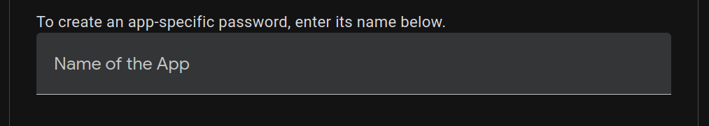

  - Copy the generated app password.

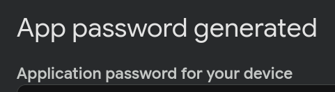

In your `.env` file, replace:

- **PERSONA_FROM_EMAIL** and **SMTP_USER** by the address mail you just created.
- **SMTP_PASS** by the application password you just created.
- **SMTP_HOST** by **'smtp.gmail.com'**.
- **SMTP_PORT** by **'465'**.

The `# Email SMTP` section is now configured.
*Important: when creating the SMTP credential in n8n, use port 465 with SSL/TLS enabled.*

### Gemini API setup

For the `# Gemini` section, you need to create a Gemini API Key.

- Go to *https://ai.google.dev/gemini-api/*.
- Log in with your Google account.
- Click on the **'Get API Key'** button.


- Click on 'Create an API Key'

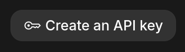

- Clikc on 'Copy the Key'

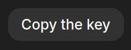

In your `.env` file, replace:

- **GEMINI_API_KEY** by the API Key you just copied.
- **GEMINI_MODEL** by **'models/gemini-3.1-flash-lite'**.

The `# Gemini` section is now configured.

### Step 2.2 : Launch

To launch n8n while keeping your workflows, credentials, and local n8n data between restarts, run one of the following commands at the root of the project.

You can use the provided script:
```bash
./persona.sh
```

Or run the Docker command manually:
```bash
docker run -it --rm --env-file .env --name persona-n8n -p 5678:5678 -v ~/.n8n:/home/node/.n8n n8nio/n8n
```

(Both commands do the same thing.)

After a few moments, your terminal should display the following message:

```bash
Editor is now accessible via:
http://localhost:5678

Press "o" to open in Browser.
```

#### Tutorial:
[Video - n8n](installation_videos/Launching(n8n).webm)

### Step 2.3 : Accessing the n8n Interface

To open the application in your browser, you can use one of the following methods:

- Keyboard shortcut: Hold down the CTRL key and click directly on the link http://localhost:5678 in your terminal.

- Copy and paste: Copy the address http://localhost:5678 and paste it into your web browser's address bar.

- Automatic opening: Simply press the "o" key on your keyboard directly in the terminal.

### Step 2.4 : Initial Setup
[(Setup - Video)](installation_videos/Launching(n8n).webm)

Upon your first login, n8n will redirect you to a setup page. The application will ask you to create your administrator account by entering your email address, name, and a secure password.

Once this information is completed, you will be automatically redirected to the application's main interface.

### Step 2.5 : Setup credentials in n8n

- Go to `Credentials` section.

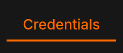

- Click on **create credential**.

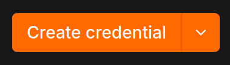

---

## SMTP:

- Choose `SMTP`.

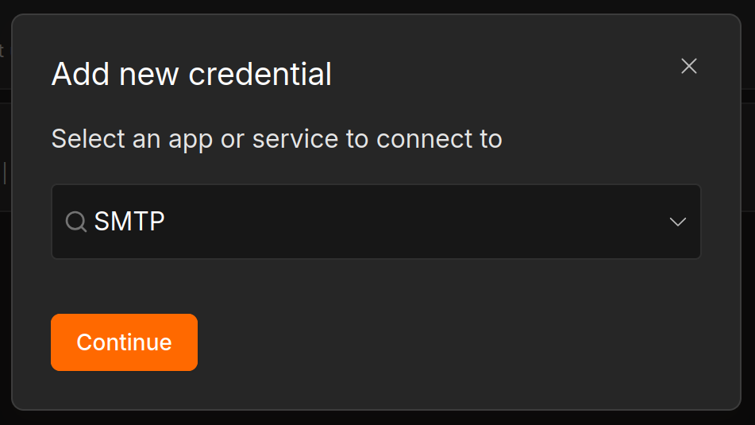

- For each field, switch the value mode to `Expression`.

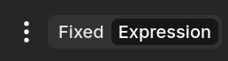

- Set a name as `SMTP from env` for example
- Fill in the SMTP fields using environment variables with the following format:

```text
{{ $env.VARIABLE }}
```

Example:

  User: {{ $env.SMTP_USER }}
  Password: {{ $env.SMTP_PASS }}
  Host: {{ $env.SMTP_HOST }}
  Port: {{ $env.SMTP_PORT }}

#### *(Note: The `[ERROR: access to env vars denied]` message and the red highlight may appear in the n8n editor. This is only a visual issue and does not prevent the workflow from running correctly.)*

- Enable SSL/TLS.
- The Client Host Name field can stay empty.

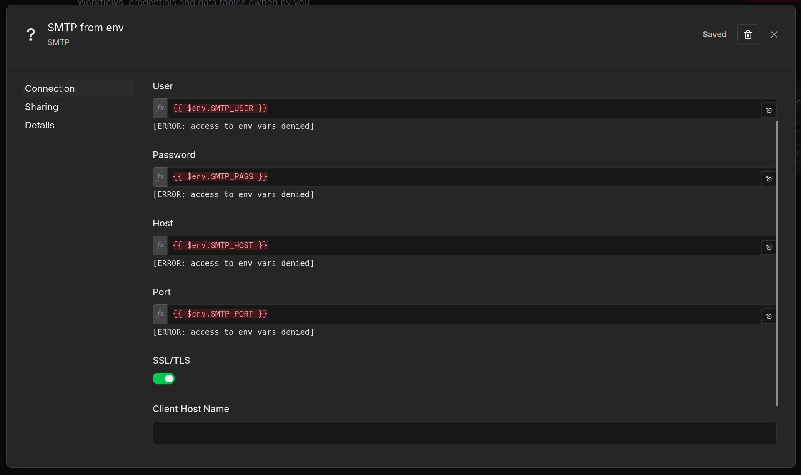

- Save.

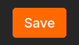

The SMTP credential is now configured.

#### Tutorial:
[Smtp - Video](installation_videos/Credentials(Smtp).webm)

## Gemini API Key:

- Choose `Google Gemini(PaLM) Api`.

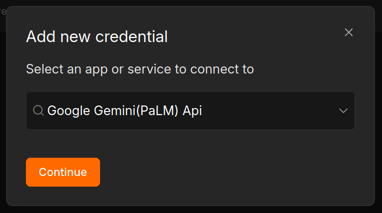

- For the API key field, switch the value mode to `Expression`.


- Set a name, for example `gemini api key`.
- Set the API key from the environment variable:

```text
{{ $env.GEMINI_API_KEY }}
```

The other fields can stay unchanged.

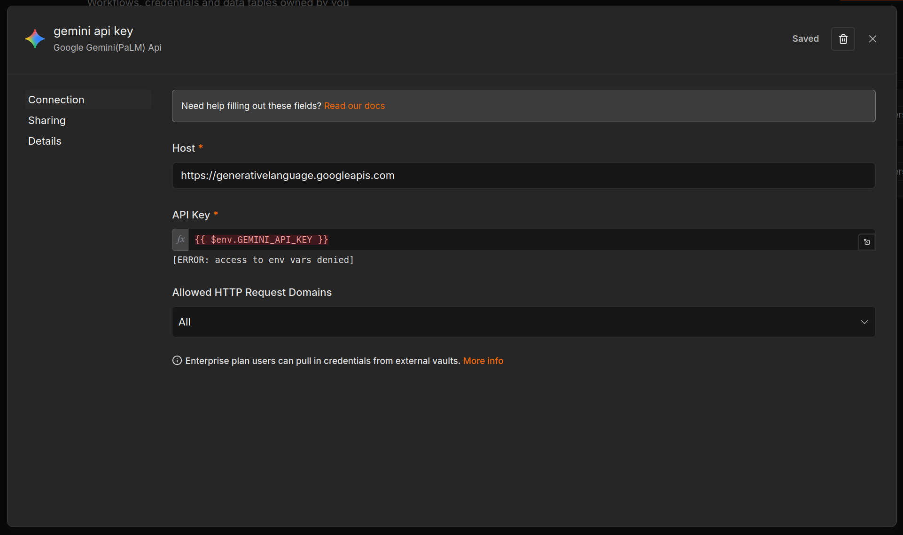

- Save.


The Gemini API key credential is now configured.

#### Tutorial:
[Gemini - Video](installation_videos/Credentials(Gemini).webm)

## Credentials Result

The `Credentials` section must look like this after configuration.

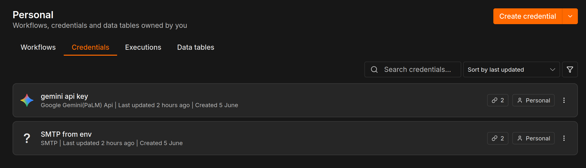

## Database

- Go to `Data tables` section.

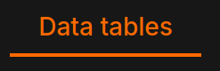

- Click on **Create data tables**.

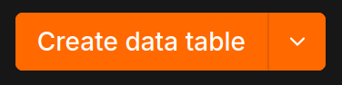

  - Choose a name, for example `DATABASE`.
  - Select the CSV format.
  - Import `USER.csv` file from the `src/` folder.

#### Tutorial:
[(Database - Video)](installation_videos/Import(database).webm)

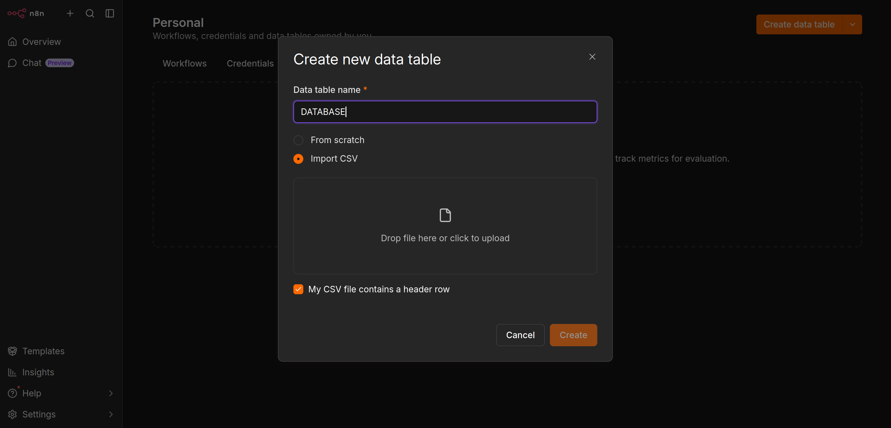

- After validation, if everything has been imported correctly, you should see the imported table.

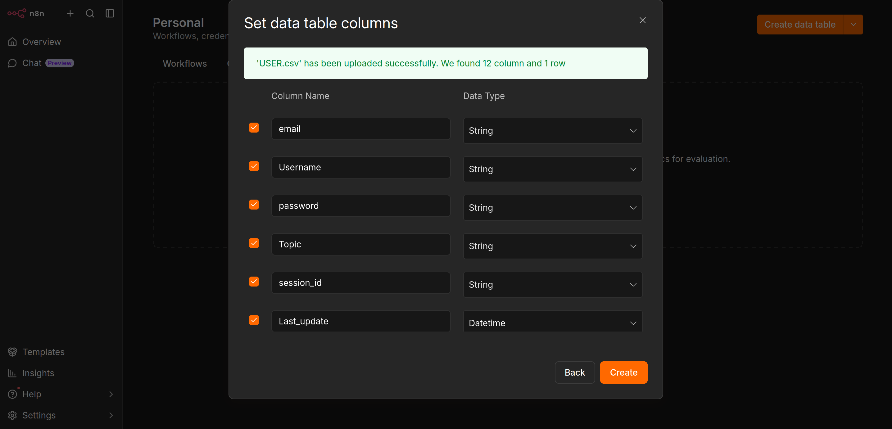

## Data tables Result

The `Data tables` section should look like this after configuration.

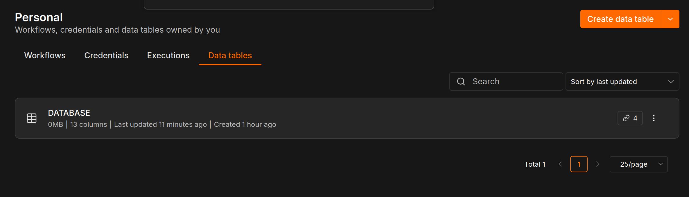 

## 3. Importing Workflows

In this section, you will learn how to import the various workflows needed to launch, test, and run the entire project.

### Step 3.1 : Creating and Importing Workflows

For each `.json` file in your **source** folder, you will need to create a dedicated workflow in n8n.

Here's how:

1. From the n8n main menu, click the orange **Add workflow** button in the top right corner or start from scratch:

#### **Image**:
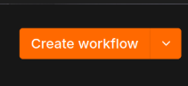

2. Once you are in your new, empty workflow, click the **three dots (...)** icon in the top right corner of the screen, then select **Import from file...**:

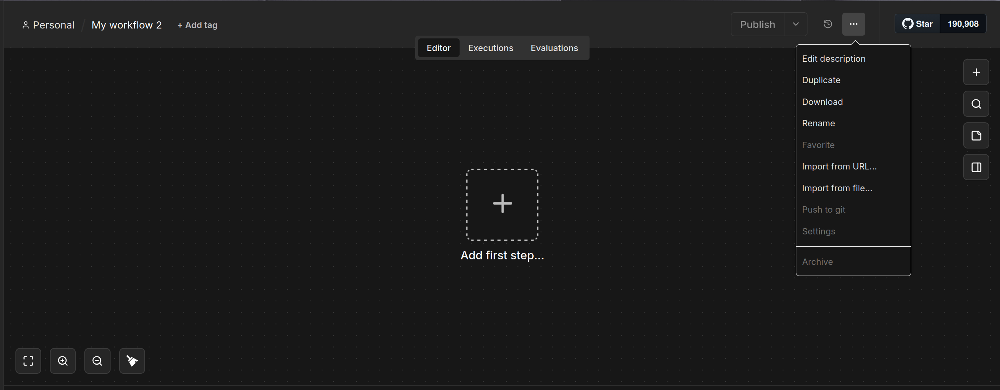

3. Choose one of the `.json` files from the source folder to import.

4. To return to the home screen and move to the next file, you can click the **n8n** logo (top left corner) or the **Personal** tab in the sidebar menu.

#### Tutorial:
[(Create - Video)](installation_videos/Create(workflow).webm)

**Important reminder:** Please repeat this process for **each** of the `.json` files in the source folder. A `.json` file corresponds strictly to a single workflow in n8n.

---

### Step 3.2 : Set up credentials in workflows

For each workflow, whenever you see one of the nodes shown below, open it and select the correct credential or data table, as shown in the examples.

---

### SMPT

When you see this SMTP node:

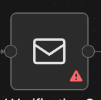

Select the SMTP credential you created earlier:

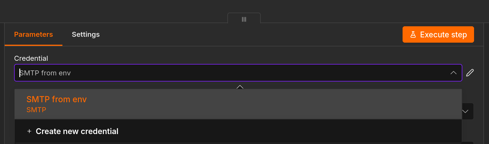

---

### Gemini API Key

When you see this Gemini node:


Select the Gemini API key credential you created earlier:

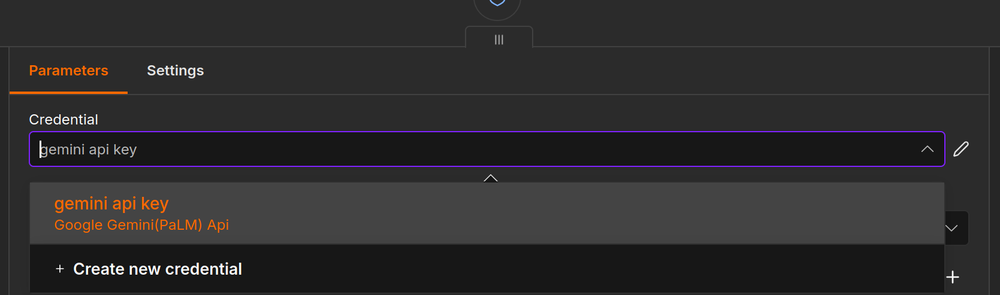

---

### DataBase

When you see this Data Table node:

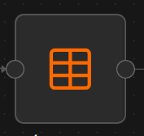

Select the database you imported earlier:

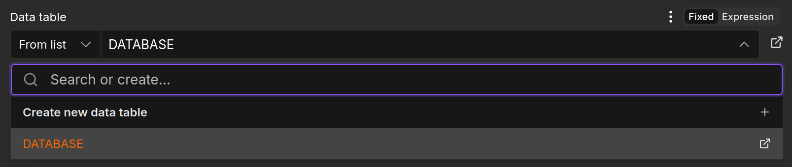

## **Important reminder:** Please repeat this process for **each** workflow.

### Step 3.3 : Overview of imported workflows

Once the 4 files have been successfully imported, return to your main dashboard. You should see the following:

.png)

Your **4 workflows** are now correctly installed and ready to be configured for the rest of the project!


### Step 3.4 : Start workflows

To link the workflows, all that remains is to publish them; for each one, you must click the Publish button.

From:

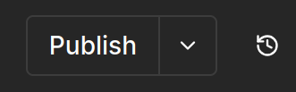

To:

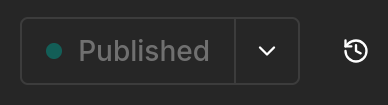

#### Tutorial:
[Video - Publish](installation_videos/Publish.webm)

**Important reminder:** Please repeat this process for **each** workflow.

---

## 4. Project Launch

In this final section, we will see how to execute a workflow and analyze the results it produces.

### Step 4.1 : Retrieving the Authentication Link

To launch the application, we need to retrieve the public access link generated by n8n:

1. Access the workflow named **Authentication** from your dashboard.
2. Locate the starting node labeled **Start form** and double-click it to open its settings.
3. Find the **Production URL** and copy it.

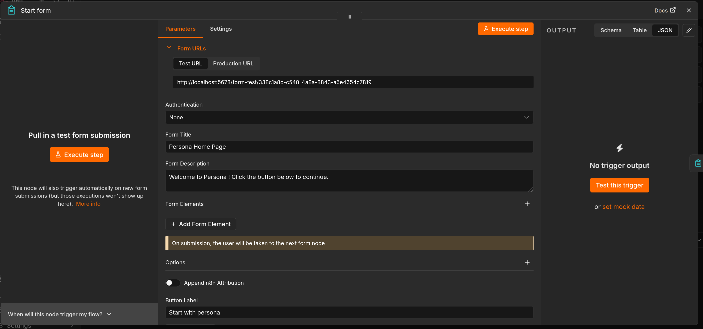

This unique link will allow you to directly access our system's secure authentication page from any web browser.

Here is the result:

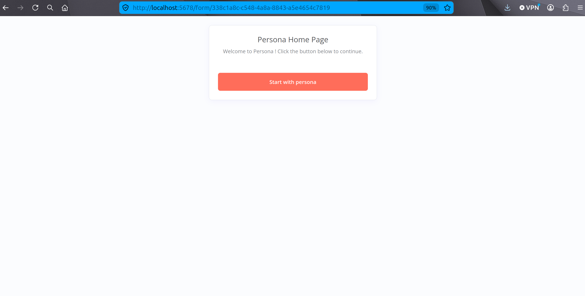